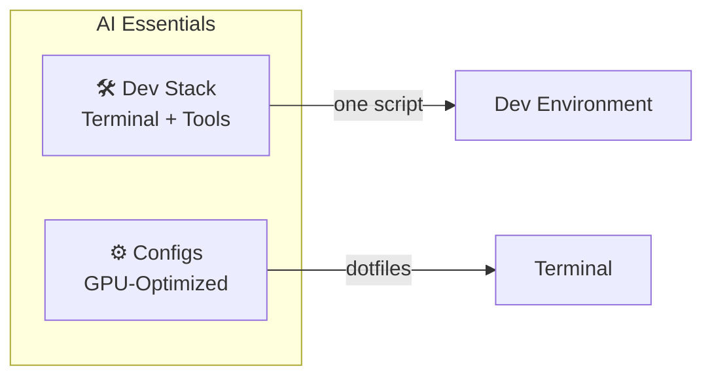
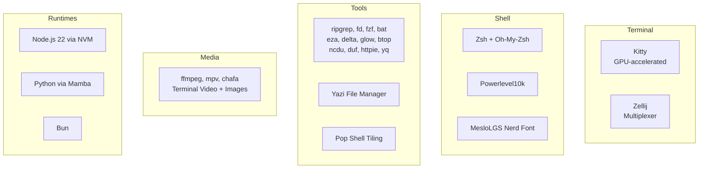

# AI Essentials

**Production-ready tools for AI developers on Linux GPU workstations.**

Skip the setup grind. Get a complete AI development environment with one-line installers: a tuned terminal stack and battle-tested configs for high-performance hardware.


```mermaid
graph LR
    subgraph "AI Essentials"
        DEV["🛠️ Dev Stack<br/>Terminal + Tools"]
        CFG["⚙️ Configs<br/>GPU-Optimized"]
    end

    DEV --> |"one script"| ENV["Dev Environment"]
    CFG --> |"dotfiles"| TERM["Terminal"]
```

---

## What's Inside

| Component | What It Does | Install |
|-----------|--------------|---------|
| [**Dev Stack**](#-ai-developer-stack) | Complete terminal environment | `./setup-ai-dev-stack.sh` |
| [**Configs**](#-configuration-files) | OLED/4K-optimized dotfiles | Copy to `~/.config/` |

---

## 🛠️ AI Developer Stack

**A complete terminal environment in one script.**

Everything you need for AI development: modern terminal, smart shell, fast tools, multiple runtimes. Idempotent — safe to run multiple times.

```bash
# Clone and run
git clone https://github.com/AeyeOps/ai-essentials.git
cd ai-essentials
./scripts/setup-ai-dev-stack.sh
```

### What Gets Installed


```mermaid
graph TD
    subgraph Terminal
        K[Kitty<br/>GPU-accelerated]
        Z[Zellij<br/>Multiplexer]
    end

    subgraph Shell
        ZSH[Zsh + Oh-My-Zsh]
        P10K[Powerlevel10k]
        FONT[MesloLGS Nerd Font]
    end

    subgraph Tools
        CLI[ripgrep, fd, fzf, bat<br/>eza, delta, glow, btop<br/>ncdu, duf, httpie, yq]
        YAZI[Yazi File Manager]
        POP[Pop Shell Tiling]
    end

    subgraph Media
        MEDIA[ffmpeg, mpv, chafa<br/>Terminal Video + Images]
    end

    subgraph Runtimes
        NODE[Node.js 22 via NVM]
        PY[Python via Mamba]
        BUN[Bun]
    end
```

| Category | Components |
|----------|------------|
| **Terminal** | Kitty (GPU-optimized), Zellij (multiplexer) |
| **Shell** | Zsh, Oh-My-Zsh, Powerlevel10k, MesloLGS Nerd Font |
| **CLI Tools** | ripgrep, fd, fzf, bat, eza, delta, glow, btop, ncdu, duf, httpie, yq, shellcheck, p7zip |
| **File Manager** | Yazi (Rust-based TUI with previews) |
| **Tiling** | Pop Shell (GNOME extension) |
| **Runtimes** | NVM + Node.js 22, Mamba + Python, Bun |
| **Utilities** | direnv (per-project env vars) |
| **Media** | ffmpeg, mpv (Kitty video playback), chafa (terminal images) |
| **Auto-config** | Kitty as default terminal (GNOME), git delta as pager, fzf shell integration |

### Auto-Configuration

The script wires installed tools together as active defaults:

| Config | What It Does |
|--------|--------------|
| **Kitty default terminal** | GNOME Ctrl+Alt+T opens Kitty instead of gnome-terminal |
| **git delta pager** | `git diff`, `git log`, `git show` render with syntax highlighting and side-by-side view |
| **fzf shell integration** | Ctrl+T (find files), Ctrl+R (search history), Alt+C (cd to directory) |

Works on both **amd64** and **arm64** (including NVIDIA GB10/DGX Spark).

### Terminal Media Playback

The media tools turn Kitty into a visual workstation — video, images, and GIFs render directly in the terminal at full resolution using Kitty's GPU-accelerated graphics protocol.

| Capability | How | Example |
|------------|-----|---------|
| **Play video in terminal** | mpv renders via Kitty graphics protocol | `mpvk video.mp4` |
| **Preview images** | chafa auto-detects Kitty for pixel-perfect output | `chafa screenshot.png` |
| **Browse visual files** | Yazi uses chafa for inline image previews | `y ~/Pictures` |
| **Inspect video metadata** | ffprobe (bundled with ffmpeg) | `ffprobe -hide_banner clip.mp4` |
| **Convert media** | ffmpeg for transcoding, extraction, format conversion | `ffmpeg -i input.mkv output.mp4` |

**Why this matters for AI developers:** Model output visualization, dataset inspection, generated media review — all without leaving the terminal or opening a separate GUI app.

**Cross-tool synergy:**

- **Kitty + mpv** — `mpvk` uses shared memory (`--vo-kitty-use-shm`) to push frames at ~60fps locally, bypassing base64 encoding entirely. Full playback controls: seek, pause, subtitles, audio.
- **Kitty + chafa** — chafa auto-detects Kitty's graphics protocol, falling back gracefully to sixel or Unicode block art in other terminals or over SSH.
- **Yazi + chafa** — The file manager uses chafa as its image preview backend. Browse directories of images, screenshots, or model outputs with inline thumbnails.
- **ffmpeg as foundation** — Provides the decode libraries that mpv uses, plus standalone tools (`ffmpeg`, `ffprobe`) for batch processing and inspection.

---

## ⚙️ Configuration Files

**Pre-tuned dotfiles for high-performance GPU systems.**

Located in `configs/` — copy what you need or use as reference.

| Config | Highlights |
|--------|------------|
| **Kitty** | True black (#000000) for OLED, 4K grid sizing, 50k scrollback, low-latency GPU settings |
| **Ghostty** | Transparent-tmux session launcher + desktop-specific Ghostty decoration fix (see below) |
| **Zellij** | Modern theme matching Powerlevel10k classic darkest |
| **Pop Shell** | 4px gaps, smart-gaps, active-hint, hidden window titles |

```bash
# Example: Install Kitty config
mkdir -p ~/.config/kitty
cp configs/kitty/kitty.conf ~/.config/kitty/
```

---

## 👻 Ghostty Session Launcher

**Transparent tmux under Ghostty, so a crash is cheap to recover from.**

Every Ghostty surface — window, tab, or native split — lands in its own tmux session through one fzf screen that names the new session, lists detached sessions, and pulls selected ones back in as panes. Offered as an optional, prompted component of the dev-stack installer.

Two install paths (the installer asks which):

- **Integrate** — additive. Keeps your existing config; adds a `config-file` include plus the shell rc guard. Overrides only `alt+d`, `alt+shift+d`, and, when needed, Ghostty decoration keys. Reversible by hand.
- **Full AEO** — opinionated bundle (AEO tmux + Ghostty config + launcher). Replaces your Ghostty and tmux configs after a pre-confirm screen that names every file, makes timestamped backups, and generates a one-command `restore-<stamp>.sh`.

**Decoration mouse fix:** on Plasma/KWin, Ghostty uses `window-decoration = server` plus `gtk-titlebar = false` so KWin provides resize handles without GTK CSD frame offsets that can shift clicks by rows and columns. On tiling WMs without usable server-side decorations, the installer can still enable the borderless `window-decoration = none` fallback. Diagnose by hand with `xprop _GTK_FRAME_EXTENTS`.

Requires Ghostty and fzf 0.45+ (the installer resolves or installs a new-enough fzf). See [`configs/ghostty/`](configs/ghostty/) for details.

---

## 🌐 WSL2 Browser Automation

For developers running Playwright, Puppeteer, or Chrome DevTools Protocol in WSL2:

```bash
./scripts/google-chrome-wsl2.sh
```

Handles D-Bus sessions, GPU acceleration workarounds, and display server compatibility automatically.

---

## Project Goals

- **Practical** — Solve real problems, not theoretical ones
- **Lightweight** — Minimal dependencies, auditable scripts
- **Portable** — Works across amd64/arm64, Ubuntu/Debian
- **No lock-in** — Framework-agnostic, standard tools

---

## Repository Structure

```
ai-essentials/
├── scripts/
│   ├── setup-ai-dev-stack.sh
│   ├── google-chrome-wsl2.sh
│   └── update-coding-agents.sh
├── configs/
│   ├── ghostty/          # Session launcher + decoration fix
│   ├── kitty/
│   ├── tmux/
│   ├── zellij/
│   └── pop-shell/
├── docs/                 # Guides and patterns
└── AGENTS.md            # AI assistant conventions
```

---

## Contributing

Contributions welcome! See [CONTRIBUTING.md](CONTRIBUTING.md) and [CODE_OF_CONDUCT.md](CODE_OF_CONDUCT.md).

## Upstream Sources & Versioning Policy

This stack intentionally tracks upstream releases at install time rather than pinning specific versions. The trade-offs are deliberate and documented here so consumers can decide if the policy fits their threat model.

- **CLI tools fetched from GitHub `releases/latest`**: `eza`, `delta`, `glow`, `duf`, `yazi`, `zellij`, `zjstatus.wasm`. The installer queries each project's GitHub API for the latest tag at run time and downloads that release. No version constants are hard-coded; no checksum or signature verification is performed beyond what TLS provides during the curl download. Trade-off: stays current with upstream fixes vs. accepts upstream supply-chain drift on every run.
- **Vendor install scripts piped to a shell**: `nvm` (pinned to `v0.40.1`), `bun` (`https://bun.sh/install`), Anthropic Claude Code installer (`https://claude.ai/install.sh`), and Homebrew (`https://raw.githubusercontent.com/Homebrew/install/HEAD/install.sh`). These follow each vendor's documented canonical install path. No checksum verification beyond TLS. Trade-off: parity with the install instructions each vendor publishes vs. trust delegated to the vendor's release pipeline.
- **`apt-get install`**: invoked with `-y` and without `--no-install-recommends`. Behavior matches Ubuntu's default and pulls recommended dependencies (often relevant for desktop/media packages such as `mpv`, `ffmpeg`, `kitty`).
- **Node devDependencies in `aeo-cc-sessions-vsix/`**: caret ranges are kept (e.g. `^1.110.0`, `^5.7.0`). The committed `package-lock.json` pins the actual installed tree, so reproducibility for the published VSIX is preserved at lockfile granularity.
- **Python**: `pyproject.toml` declares no runtime dependencies; no lockfile is committed.

If any of the above is incompatible with your environment's policy, fork the repository and replace the dynamic version lookups with pinned constants and checksum verification before running the installers.

## Security

Never commit secrets. Use environment variables and secret managers. See `.gitignore` for excluded patterns.

## License

MIT — see [LICENSE](LICENSE).

---

**Maintainer:** [AeyeOps](https://github.com/AeyeOps) (support@aeyeops.com)
