# AI Essentials

**Production-ready tools for AI developers on Linux GPU workstations.**

Skip the setup grind. Get a complete AI development environment with one-line installers: speech-to-text that works system-wide, a tuned terminal stack, and battle-tested configs for high-performance hardware.

```mermaid
graph LR
    subgraph "AI Essentials"
        STT["🎤 AEO Push-to-Talk<br/>Speech-to-Text"]
        DEV["🛠️ Dev Stack<br/>Terminal + Tools"]
        CFG["⚙️ Configs<br/>GPU-Optimized"]
    end

    STT --> |"Ctrl+Super"| APP["Any App"]
    DEV --> |"one script"| ENV["Dev Environment"]
    CFG --> |"dotfiles"| TERM["Terminal"]
```



---

## What's Inside

| Component | What It Does | Install |
|-----------|--------------|---------|
| [**AEO Push-to-Talk**](#-aeo-push-to-talk) | Dictate anywhere with Ctrl+Super | `curl ...install.sh \| bash` |
| [**Dev Stack**](#-ai-developer-stack) | Complete terminal environment | `./setup-ai-dev-stack.sh` |
| [**Configs**](#-configuration-files) | OLED/4K-optimized dotfiles | Copy to `~/.config/` |

---

## 🎤 AEO Push-to-Talk

**Speak instead of type — in any application.**

GPU-accelerated speech-to-text using NVIDIA Parakeet models. Press a hotkey, talk, release — text appears at your cursor. Works in VS Code, browsers, Slack, terminals, everywhere.

```bash
curl -fsSL https://raw.githubusercontent.com/AeyeOps/ai-essentials/main/packages/stt-service/install.sh | bash
```

Answer yes to all prompts, log out and back in. Done.

### How It Works

```mermaid
sequenceDiagram
    participant U as You
    participant T as Tray Icon
    participant S as STT Server
    participant A as Active Window

    Note over T: 🟢 Ready
    U->>T: Press Ctrl+Super
    Note over T: 🔴 Recording
    U->>S: Audio stream
    U->>T: Release keys
    S->>A: Type transcribed text
    Note over T: 🟢 Ready
```



### Key Features

| Feature | Description |
|---------|-------------|
| **System-wide hotkey** | Ctrl+Super works in any app (X11) |
| **Auto-start** | Server on boot, client at login |
| **Tray indicator** | Gray (connecting) → Green (ready) → Red (recording) |
| **Fast** | 40-200ms latency after GPU warmup |
| **Flexible output** | Type at cursor, copy to clipboard, or stdout |

### Requirements

- NVIDIA GPU with CUDA support
- Ubuntu/Debian-based Linux
- ~3GB disk space (model + dependencies)

📖 [Full documentation](packages/stt-service/README.md)

---

## 🛠️ AI Developer Stack

**A complete terminal environment in one script.**

Everything you need for AI development: modern terminal, smart shell, fast tools, multiple runtimes. Idempotent — safe to run multiple times.

```bash
# Clone and run
git clone https://github.com/AeyeOps/ai-essentials.git
cd ai-essentials
./scripts/setup-ai-dev-stack.sh
```

### What Gets Installed


| Category | Components |
|----------|------------|
| **Terminal** | Kitty (GPU-optimized), Zellij (multiplexer) |
| **Shell** | Zsh, Oh-My-Zsh, Powerlevel10k, MesloLGS Nerd Font |
| **CLI Tools** | ripgrep, fd, fzf, bat, eza, delta, glow, btop, ncdu, duf, httpie, yq, shellcheck, p7zip |
| **File Manager** | Yazi (Rust-based TUI with previews) |
| **Tiling** | Pop Shell (GNOME extension) |
| **Runtimes** | NVM + Node.js 22, Mamba + Python, Bun |
| **Utilities** | direnv (per-project env vars) |
| **Media** | ffmpeg, mpv (Kitty video playback), chafa (terminal images) |
| **Auto-config** | Kitty as default terminal (GNOME), git delta as pager, fzf shell integration |

### Auto-Configuration

The script wires installed tools together as active defaults:

| Config | What It Does |
|--------|--------------|
| **Kitty default terminal** | GNOME Ctrl+Alt+T opens Kitty instead of gnome-terminal |
| **git delta pager** | `git diff`, `git log`, `git show` render with syntax highlighting and side-by-side view |
| **fzf shell integration** | Ctrl+T (find files), Ctrl+R (search history), Alt+C (cd to directory) |

Works on both **amd64** and **arm64** (including NVIDIA GB10/DGX Spark).

### Terminal Media Playback

The media tools turn Kitty into a visual workstation — video, images, and GIFs render directly in the terminal at full resolution using Kitty's GPU-accelerated graphics protocol.

| Capability | How | Example |
|------------|-----|---------|
| **Play video in terminal** | mpv renders via Kitty graphics protocol | `mpvk video.mp4` |
| **Preview images** | chafa auto-detects Kitty for pixel-perfect output | `chafa screenshot.png` |
| **Browse visual files** | Yazi uses chafa for inline image previews | `y ~/Pictures` |
| **Inspect video metadata** | ffprobe (bundled with ffmpeg) | `ffprobe -hide_banner clip.mp4` |
| **Convert media** | ffmpeg for transcoding, extraction, format conversion | `ffmpeg -i input.mkv output.mp4` |

**Why this matters for AI developers:** Model output visualization, dataset inspection, generated media review — all without leaving the terminal or opening a separate GUI app.

**Cross-tool synergy:**

- **Kitty + mpv** — `mpvk` uses shared memory (`--vo-kitty-use-shm`) to push frames at ~60fps locally, bypassing base64 encoding entirely. Full playback controls: seek, pause, subtitles, audio.
- **Kitty + chafa** — chafa auto-detects Kitty's graphics protocol, falling back gracefully to sixel or Unicode block art in other terminals or over SSH.
- **Yazi + chafa** — The file manager uses chafa as its image preview backend. Browse directories of images, screenshots, or model outputs with inline thumbnails.
- **ffmpeg as foundation** — Provides the decode libraries that mpv uses, plus standalone tools (`ffmpeg`, `ffprobe`) for batch processing and inspection.

---

## ⚙️ Configuration Files

**Pre-tuned dotfiles for high-performance GPU systems.**

Located in `configs/` — copy what you need or use as reference.

| Config | Highlights |
|--------|------------|
| **Kitty** | True black (#000000) for OLED, 4K grid sizing, 50k scrollback, low-latency GPU settings |
| **Zellij** | Modern theme matching Powerlevel10k classic darkest |
| **Pop Shell** | 4px gaps, smart-gaps, active-hint, hidden window titles |

```bash
# Example: Install Kitty config
mkdir -p ~/.config/kitty
cp configs/kitty/kitty.conf ~/.config/kitty/
```

---

## 🌐 WSL2 Browser Automation

For developers running Playwright, Puppeteer, or Chrome DevTools Protocol in WSL2:

```bash
./scripts/google-chrome-wsl2.sh
```

Handles D-Bus sessions, GPU acceleration workarounds, and display server compatibility automatically.

---

## Project Goals

- **Practical** — Solve real problems, not theoretical ones
- **Lightweight** — Minimal dependencies, auditable scripts
- **Portable** — Works across amd64/arm64, Ubuntu/Debian
- **No lock-in** — Framework-agnostic, standard tools

---

## Repository Structure

```
ai-essentials/
├── packages/
│   └── stt-service/      # AEO Push-to-Talk
├── scripts/
│   ├── setup-ai-dev-stack.sh
│   ├── google-chrome-wsl2.sh
│   └── update_cli_ubuntu.sh
├── configs/
│   ├── kitty/
│   ├── zellij/
│   └── pop-shell/
├── docs/                 # Guides and patterns
└── AGENTS.md            # AI assistant conventions
```

---

## Contributing

Contributions welcome! See [CONTRIBUTING.md](CONTRIBUTING.md) and [CODE_OF_CONDUCT.md](CODE_OF_CONDUCT.md).

## Security

Never commit secrets. Use environment variables and secret managers. See `.gitignore` for excluded patterns.

## License

MIT — see [LICENSE](LICENSE).

---

**Maintainer:** [AeyeOps](https://github.com/AeyeOps) (support@aeyeops.com)
