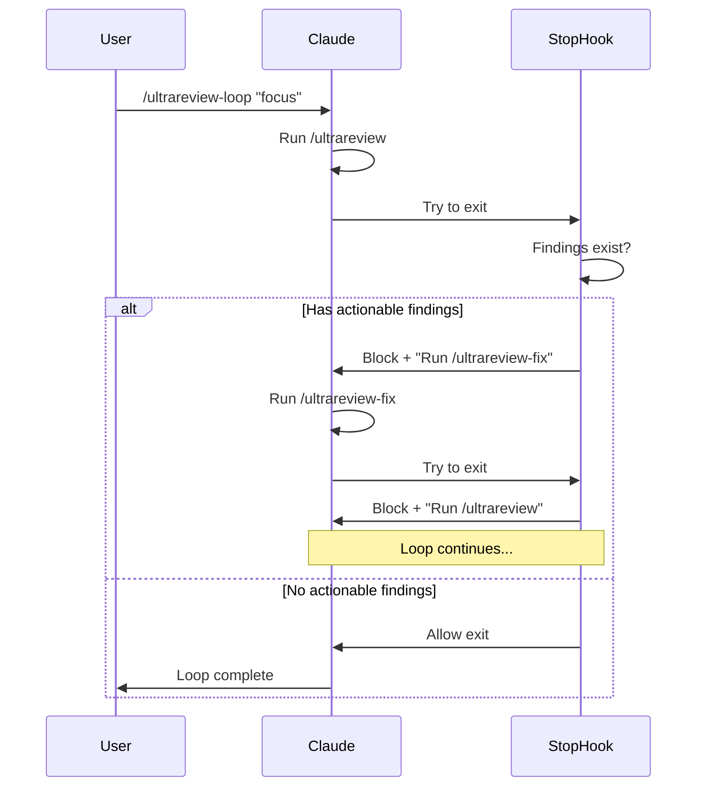

# Ultrareview Command Suite

Deep validation and systematic fixing of plans, code, and context for Claude Code.

## Commands

| Command | Description |
|---------|-------------|
| `/ultrareview` | Deep validation - finds errors, gaps, alignment issues, improvements |
| `/ultrareview-fix` | Systematically addresses all ultrareview findings |
| `/ultrareview-loop` | Automated cycle: ultrareview → fix → ultrareview until clean |

## How It Works



## Actionable Finding Markers

The loop detects these markers in ultrareview output:

| Marker | Meaning |
|--------|---------|
| `🚨 CRITICAL` | Must resolve before proceeding |
| `❌ ERRORS FOUND` | Bugs or issues by severity |
| `⚠️ ALIGNMENT ISSUES` | Conflicts with codebase patterns |
| `📋 MISSING` | Gaps needing attention |
| `💡 IMPROVEMENTS` | Better alternatives |
| `❓ NEEDS VALIDATION` | Requires investigation |
| `✅ VALIDATED` | Confirmed correct (no action needed) |

When only `✅ VALIDATED` remains (or no findings), the loop completes.

## Installation

### Step 1: Install the ultrareview-loop plugin

```bash
# Symlink the plugin to your Claude plugins directory
ln -s /opt/dev/aeo/ai-essentials/claude-code/commands/ultrareview/ultrareview-loop \
      ~/.claude/plugins/ultrareview-loop
```

### Step 2: Install the base commands

Copy or symlink the ultrareview commands to your Claude commands directory:

```bash
# Copy commands
cp /opt/dev/aeo/ai-essentials/claude-code/commands/ultrareview/ultrareview.md \
   ~/.claude/commands/

cp /opt/dev/aeo/ai-essentials/claude-code/commands/ultrareview/ultrareview-fix.md \
   ~/.claude/commands/

# Or symlink them
ln -s /opt/dev/aeo/ai-essentials/claude-code/commands/ultrareview/ultrareview.md \
      ~/.claude/commands/ultrareview.md

ln -s /opt/dev/aeo/ai-essentials/claude-code/commands/ultrareview/ultrareview-fix.md \
      ~/.claude/commands/ultrareview-fix.md
```

### Step 3: Restart Claude Code

The plugin will be loaded on the next session start.

## Usage

### Basic validation

```
/ultrareview
```

Validates the entire preceding context (plan, code, discussion).

### Focused validation

```
/ultrareview the API changes
```

Focuses validation on a specific area.

### Fix findings

```
/ultrareview-fix
```

Addresses all findings from the most recent ultrareview.

### Automated loop

```
/ultrareview-loop "the authentication flow"
```

Runs the full cycle automatically until no actionable findings remain.

```
/ultrareview-loop --max-iterations 15 "database migrations"
```

Limits the loop to 15 iterations maximum.

## Multi-User Safety

When multiple users share the same project, the loop uses session tokens to prevent interference:

- Each `/ultrareview-loop` generates a unique token (e.g., `ulr-a1b2c3d4`)
- The token is stored in both the state file and session environment
- The stop hook only processes exits from the matching session
- Other users' sessions pass through unaffected

## Stopping the Loop

The loop stops automatically when:
- No actionable findings remain after a review phase
- Max iterations is reached (default: 10)

To stop manually:
- Ask Claude: "stop the ultrareview loop"
- Or delete the state file: `rm .claude/ultrareview-loop.local.md`

## Monitoring

View current loop state:

```bash
head -10 .claude/ultrareview-loop.local.md
```

Example output:
```yaml
---
active: true
token: "ulr-a1b2c3d4"
iteration: 3
max_iterations: 10
phase: fix
initial_focus: "the API changes"
started_at: "2026-01-19T12:00:00Z"
---
```

## Directory Structure

```
claude-code/commands/ultrareview/
├── README.md                     # This file
├── ultrareview.md                # Deep validation command
├── ultrareview-fix.md            # Systematic fixing command
└── ultrareview-loop/             # Loop plugin
    ├── .claude-plugin/
    │   └── plugin.json           # Plugin manifest
    ├── commands/
    │   └── ultrareview-loop.md   # Start command
    ├── hooks/
    │   ├── hooks.json            # Hook registration
    │   └── stop-hook.sh          # Core loop logic
    └── scripts/
        └── setup-ultrareview-loop.sh  # Initialize state
```
