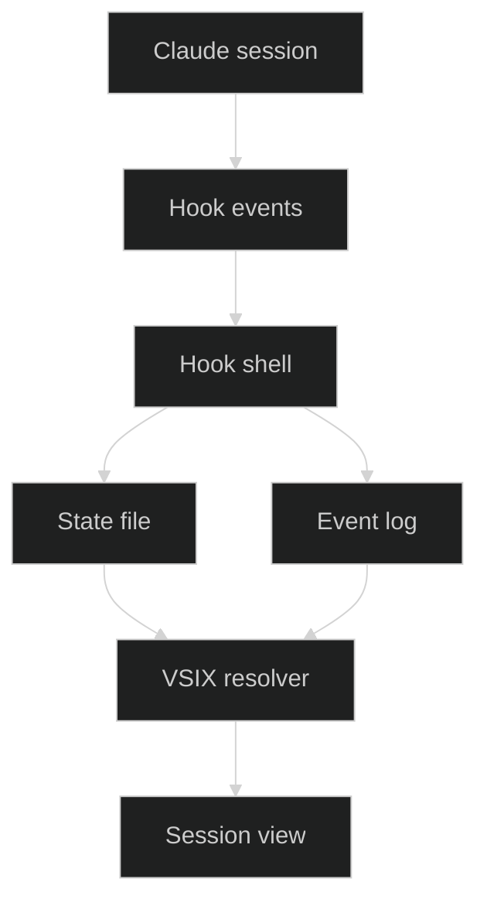
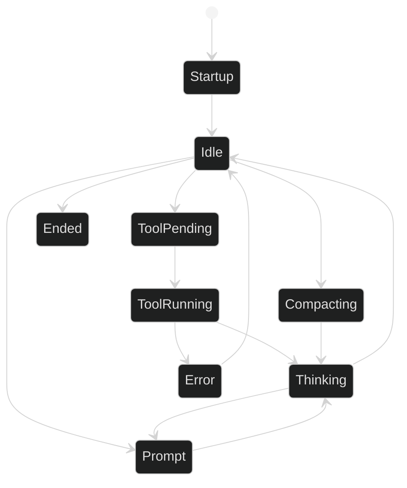
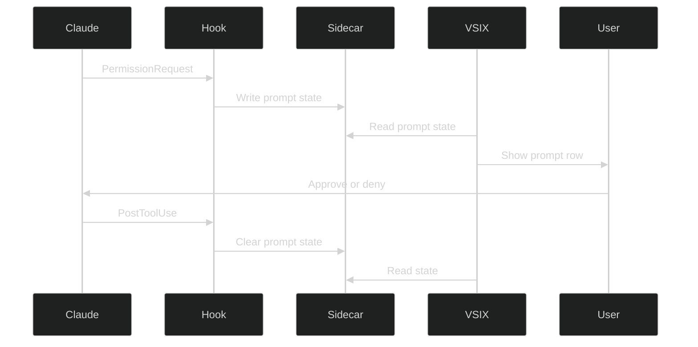

# Claude Code Hook Sidecar Lineage Spec

## Status

Draft implementation spec and execution plan for adding a mandatory Claude Code hook sidecar as a second authoritative source for the AEO VSC CC Sessions VSIX.

This document is intentionally split into:

- **Verified facts**: confirmed from official Claude Code documentation or from live local transcript evidence
- **Open validation items**: must be proven locally before we treat them as production truths

The goal is to avoid guesswork.

## Objective

Provide a deterministic per-Claude-process state and lineage signal that the VSIX can trust ahead of transcript inference.

This must improve:

- active prompt and permission detection
- `/clear` and `/compact` lineage
- `--resume` and `--continue` lineage
- heavy-load correctness when many concurrent sessions run in the same project

The mandatory hook sidecar will be the **first-class authoritative runtime source**.

Transcript files and `history.jsonl` remain the **supporting recovery source** for the VSIX runtime, but this roadmap does not propose a separate no-hook product mode.

`statusline` remains an **optional hint only** and must never be required for correctness.

## Problem Statement

The current VSIX can only infer several important states from transcript and history artifacts.

This is workable for many cases, but it is not strong enough under high concurrency:

- 6 to 8 Claude terminals in one Code or Code Insiders window
- often 3 to 4 concurrent sessions in the same project
- expert users managing up to 12 sessions across multiple windows and editor variants

The main failure classes observed so far are:

- transcript rotation without an immediately obvious parent to child link
- permission prompts for `Edit` and `Bash` where the transcript shows only a `tool_use` and later a `tool_result`
- active background agent progress hidden inside `progress` records rather than top-level `assistant` records
- same-project concurrency where time-based proximity is only probabilistic, not deterministic

## Verified Facts From Official Documentation

The following are documented by Claude Code.

### Hook configuration model

Verified:

- Claude Code supports hooks from multiple configuration scopes
- Claude plugins can provide hook handlers

This roadmap intentionally chooses the plugin mechanism only.

Source:

- https://code.claude.com/docs/en/settings
- https://docs.claude.com/en/docs/claude-code/hooks

### Plugin hooks exist

Verified:

- plugins can provide hook handlers
- plugin hook config can live in `hooks/hooks.json` at plugin root or inline in `plugin.json`

This is the preferred mechanism for this roadmap. A dedicated Claude plugin can carry the sidecar hook configuration in `hooks/hooks.json` as the only planned installation path.

Source:

- https://code.claude.com/docs/fr/plugins-reference

### Hook events available

Verified events relevant to this design:

- `SessionStart`
- `UserPromptSubmit`
- `PreToolUse`
- `PermissionRequest`
- `PostToolUse`
- `PostToolUseFailure`
- `Notification`
- `PreCompact`
- `PostCompact`
- `SessionEnd`
- `Elicitation`
- `ElicitationResult`
- `Stop`
- `SubagentStop`

Source:

- https://docs.claude.com/en/docs/claude-code/hooks-guide
- https://docs.claude.com/en/docs/claude-code/hooks

### Common hook input fields

Verified:

All hooks receive JSON on stdin with common fields including:

- `session_id`
- `transcript_path`
- `cwd`
- `permission_mode`
- `hook_event_name`

This is enough to make the sidecar useful even before adding any extra local enrichment.

Source:

- https://docs.claude.com/en/docs/claude-code/hooks

### SessionStart source values

Verified:

`SessionStart` matchers include:

- `startup`
- `resume`
- `clear`
- `compact`

The docs also explicitly state that resuming currently starts a new session under the hood.

This is extremely important for lineage.

Source:

- https://docs.claude.com/en/docs/claude-code/hooks

### Notification semantics

Verified:

`Notification` runs when Claude Code sends notifications, including:

- when Claude needs permission to use a tool
- when prompt input has been idle for at least 60 seconds

The docs cite examples equivalent to:

- permission prompt
- waiting for user input

This is the cleanest documented event for general user-attention state.

Source:

- https://docs.claude.com/en/docs/claude-code/hooks

### PermissionRequest semantics

Verified:

`PermissionRequest` exists specifically for permission dialogs.

This is the cleanest documented event for exact approval prompts such as `Edit` and `Bash`.

Source:

- https://code.claude.com/docs/fr/plugins-reference
- https://docs.claude.com/en/docs/claude-code/hooks-guide

### PreToolUse can force ask

Verified:

`PreToolUse` command hooks can return:

- `allow`
- `deny`
- `ask`

This is not needed for the first version of the sidecar because the VSIX only needs observability, not to alter Claude behavior. It is still important because it proves the permission UI is a first-class concept in Claude Code.

Source:

- https://docs.claude.com/en/docs/claude-code/hooks

### SessionStart environment persistence

Verified:

`SessionStart` hooks have access to `CLAUDE_ENV_FILE`, and values written there become available to subsequent Claude-executed Bash commands in that session.

This can be used as an optional enhancement, but it should not be the core lineage mechanism because it is only available on `SessionStart` and only for subsequent Bash commands.

Source:

- https://docs.claude.com/en/docs/claude-code/hooks

### Hook execution details

Verified:

- matching hooks run in parallel
- identical hook commands are deduplicated
- environment is current directory with Claude Code environment
- `CLAUDE_PROJECT_DIR` is available
- output handling differs by event type
- `Notification` and `SessionEnd` output is logged to debug only
- `SessionStart` and `UserPromptSubmit` stdout is added as context

This means the sidecar hooks must be extremely quiet and should not rely on stdout.

Source:

- https://docs.claude.com/en/docs/claude-code/hooks

## Verified Facts From Local Runtime Evidence

The following are proven from the live transcripts and current VSIX debugging work.

### Transcript-only approval ambiguity is real

Observed in live transcripts:

- an `Edit` or `Bash` approval prompt can show up in the terminal UI while the transcript only shows:
  - top-level `assistant` `tool_use`
  - `PreToolUse` progress entries
  - later `user` `tool_result`

There is no guaranteed distinct approval record in the transcript for every prompt.

This is exactly why a hook sidecar is valuable.

### Nested progress matters

Observed:

- active sessions can appear idle if we only inspect top-level `assistant` and `user`
- nested `agent_progress` records contain real assistant and user state

This is a transcript-parser problem the sidecar can reduce for current-state display.

### Same-project concurrency is common

Observed:

- `<project-a>` routinely has multiple concurrent terminals
- transcript rotation within a single process can create multiple session ids in the same project
- time proximity alone is insufficient to claim deterministic parent to child correlation in all cases

## Core Design Decision

Adopt a **mandatory plugin-packaged hook sidecar**.

The VSIX runtime target for this roadmap is:

- dedicated Claude plugin installed and enabled
- sidecar hook package healthy
- sidecar becomes primary runtime state source

This roadmap removes the optional no-hook fallback mode from the planned architecture.

## Scope Decision

### Preferred insertion point

Use a dedicated Claude plugin with:

- `plugin.json`
- `hooks/hooks.json`
- hook dispatcher and helper scripts under the plugin root

Reason:

- avoids mutating unrelated Claude configuration
- keeps hook configuration versioned with the sidecar implementation
- allows install, upgrade, validation, and removal as one unit
- works across projects once the plugin is enabled for the user environment

### Platform compatibility requirements

This roadmap must be explicit about runtime compatibility.

Required:

- support Linux native Claude Code
- support WSL-hosted Claude Code used from VS Code Remote
- preserve the raw paths that Claude reports without assuming path translation

Not allowed:

- assume a POSIX shell exists on all targets
- assume `.sh` is a portable hook entrypoint
- assume Windows and Linux path forms are interchangeable
- assume `/mnt/c/...`, UNC, or drive-letter translation is safe unless explicitly validated

Implementation rule:

- the primary hook implementation must be Python-based, not shell-based
- use a Python entrypoint as the canonical dispatcher logic
- shell wrappers are allowed only as thin platform-specific launchers if proven necessary

Current rollout assumption:

- Linux native and WSL are required targets for the first implementation
- native Windows hook execution remains an explicit validation item before it is treated as supported

## Architecture Overview



### Interpretation

- Claude emits lifecycle and prompt events
- the hook shell writes tiny per-process files
- the VSIX consumes those files first
- transcript and history remain supporting recovery inputs inside the VSIX, not a separate planned operating mode

## Process Identity Strategy

### Required key

Use a stable **process key**:

- `claude_pid`
- `claude_pid_start_ticks`

Combined:

- `process_key = "<pid>:<start_ticks>"`

### Why this matters

`session_id` changes across `/clear`, `/compact`, and resume-derived rotations.

The VSIX needs a stable identity for:

- one terminal
- one live Claude process
- many transcript session ids over time

### Implementation detail

The hook shell should derive the current Claude process from the hook process ancestry.

Recommended algorithm:

1. Start from the hook shell pid
2. Walk parent processes upward
3. Find the first ancestor whose cmdline identifies Claude Code
4. Record:
   - ancestor pid
   - `/proc/<pid>/stat` start ticks
   - cmdline

### Validation requirement

This ancestry assumption is not yet documented by Claude Code. It must be proven locally before rollout.

This is an explicit validation task in the plan below.

### Path handling rule

The hook sidecar must store path values exactly as received from Claude hook input.

Required fields stored as raw values:

- `cwd`
- `transcript_path`
- any future source or summary paths emitted by Claude

Not allowed:

- rewriting raw hook paths during hook execution
- converting Linux paths to Windows paths
- converting Windows paths to Linux paths
- normalizing path separators in a way that destroys the original source form

If the VSIX later needs comparison helpers, it may derive normalized comparison forms in memory, but the sidecar must preserve the original raw path strings as source truth.

## File Layout

Use **per-process state**, not one monolithic global file.

Proposed root:

- `~/.claude/aeo-vsc-cc-sessions/`

Per process:

- `processes/<pid>-<start_ticks>/state.json`
- `processes/<pid>-<start_ticks>/events.jsonl`

Optional:

- `processes/<pid>-<start_ticks>/lock`

### Why per-process files

Under 12 concurrent sessions:

- each process writes only to its own state and log
- no central lock hotspot
- the VSIX only reads files for PIDs it already owns
- same-project concurrency does not collide

## Data Model

### Hot path file

`state.json`

This is the file the VSIX reads for runtime state.

Proposed schema:

```json
{
  "schema_version": 1,
  "writer_version": "0.1.0",
  "updated_at": "2026-03-21T12:00:00Z",
  "process_key": "12345:67890",
  "claude_pid": 12345,
  "claude_pid_start_ticks": 67890,
  "cwd": "/path/to/project",
  "current_session_id": "uuid",
  "current_transcript_path": "/home/user/.claude/projects/.../uuid.jsonl",
  "state": "idle",
  "needs_user_attention": false,
  "attention_kind": null,
  "permission_mode": "default",
  "tool_name": null,
  "tool_summary": null,
  "lineage": {
    "start_source": "resume",
    "previous_session_id": "uuid-or-null",
    "previous_transcript_path": "path-or-null"
  },
  "compact": {
    "pending": false,
    "trigger": null,
    "summary_path": null
  },
  "last_event": {
    "hook_event_name": "PostToolUse",
    "ts": "2026-03-21T12:00:00Z"
  }
}
```

### Audit file

`events.jsonl`

Every event written append-only.

Proposed per-record schema:

```json
{
  "ts": "2026-03-21T12:00:00Z",
  "process_key": "12345:67890",
  "claude_pid": 12345,
  "claude_pid_start_ticks": 67890,
  "session_id": "uuid",
  "transcript_path": "/home/user/.claude/projects/.../uuid.jsonl",
  "cwd": "/path/to/project",
  "hook_event_name": "PermissionRequest",
  "permission_mode": "default",
  "notification_type": null,
  "tool_name": "Bash",
  "tool_summary": "Check account mappings",
  "source": null,
  "reason": null,
  "trigger": null
}
```

## Retention And Cleanup

The sidecar is intentionally append-friendly, but it must not accumulate indefinitely.

### SessionEnd cleanup

On `SessionEnd`:

- update `state.json` with ended state and reason
- write one final `events.jsonl` record
- do not immediately delete the process directory

Reason:

- the VSIX may still need to read the final state briefly
- immediate deletion makes debugging and race handling harder

### Garbage collection policy

The dispatcher should perform opportunistic local GC on its own root during normal writes.

Recommended policy:

- remove process directories whose `state.json` shows `state = ended` and whose `updated_at` is older than 24 hours
- remove process directories with no `state.json` but with directory mtime older than 24 hours
- keep at most the latest 2 MB or 2,000 lines of `events.jsonl` per process by truncating only during compaction-safe maintenance windows, not on every write

The VSIX should treat missing `events.jsonl` history as acceptable. `state.json` is the hot-path requirement.

## Hook Event Mapping

### Mandatory first version

#### SessionStart

Purpose:

- initialize or rotate the per-process state
- record new `current_session_id`
- record `transcript_path`
- record `source` as `startup`, `resume`, `clear`, or `compact`

#### PermissionRequest

Purpose:

- set `needs_user_attention = true`
- set `attention_kind = permission`
- record `tool_name`
- record compact `tool_summary`

This is the highest-value hook for approval dialogs.

#### Notification

Purpose:

- set `needs_user_attention = true` when Claude is waiting for input or permission
- record `notification_type`

This is the highest-value hook for generic attention state.

#### UserPromptSubmit

Purpose:

- clear prior prompt or permission state
- set current state to `thinking`

#### PreToolUse

Purpose:

- set `state = tool_pending`
- record tool metadata before execution

#### PostToolUse

Purpose:

- update current state after success
- usually clear permission prompt or pending tool state

#### PostToolUseFailure

Purpose:

- record failed tool execution
- prevent stale active states

#### PreCompact

Purpose:

- mark compaction pending
- record `trigger` as `manual` or `auto`

#### PostCompact

Purpose:

- complete compaction lineage
- record compact summary details

#### SessionEnd

Purpose:

- mark process state ended
- record `reason`

### Subagent policy

The first rollout must treat subagent hook events as **diagnostic only**.

Rules:

- do not let `SubagentStart` or `SubagentStop` overwrite the top-level per-process `state`
- if recorded, write them only to `events.jsonl`
- if future work wants subagent-aware UI, model that in a separate data structure rather than collapsing it into the main session state

Reason:

- the VSIX row represents the top-level Claude process attached to a VS Code terminal
- subagent lifecycle is useful for observability but is not the same thing as terminal-attached lineage

## State Flow



### Notes

- `Prompt` covers:
  - permission prompt
  - idle prompt
  - any other hook-backed user-attention state
- `ToolPending` means Claude intends to run a tool but it may still be waiting on permission
- `ToolRunning` means the tool is in progress after approval or auto-allow

## Sequence Flow For Permission Prompt



## Hook Command Insertion Plan

### Recommendation

Install a dedicated Claude plugin that registers a single dispatcher shell script against multiple hook events in `hooks/hooks.json`.

This is better than many one-off commands because:

- versioning is centralized
- behavior is consistent
- upgrades touch one installation target

### Recommended plugin layout

- `<plugin-root>/plugin.json`
- `<plugin-root>/hooks/hooks.json`
- `<plugin-root>/hooks/dispatch.sh`

Optional supporting files:

- `<plugin-root>/hooks/write_state.py`
- `<plugin-root>/hooks/VERSION`

### Recommended hook insertion

Example `hooks/hooks.json` fragment:

```json
{
  "hooks": {
    "SessionStart": [
      {
        "matcher": "startup|resume|clear|compact",
        "hooks": [
          {
            "type": "command",
            "command": "<plugin-root>/hooks/dispatch.sh"
          }
        ]
      }
    ],
    "PermissionRequest": [
      {
        "matcher": "*",
        "hooks": [
          {
            "type": "command",
            "command": "<plugin-root>/hooks/dispatch.sh"
          }
        ]
      }
    ],
    "Notification": [
      {
        "matcher": "permission_prompt|idle_prompt|elicitation_dialog",
        "hooks": [
          {
            "type": "command",
            "command": "<plugin-root>/hooks/dispatch.sh"
          }
        ]
      }
    ],
    "UserPromptSubmit": [
      {
        "hooks": [
          {
            "type": "command",
            "command": "<plugin-root>/hooks/dispatch.sh"
          }
        ]
      }
    ],
    "PreToolUse": [
      {
        "matcher": "Bash|Edit|Write|MultiEdit|NotebookEdit|Task",
        "hooks": [
          {
            "type": "command",
            "command": "<plugin-root>/hooks/dispatch.sh"
          }
        ]
      }
    ],
    "PostToolUse": [
      {
        "matcher": "Bash|Edit|Write|MultiEdit|NotebookEdit|Task",
        "hooks": [
          {
            "type": "command",
            "command": "<plugin-root>/hooks/dispatch.sh"
          }
        ]
      }
    ],
    "PostToolUseFailure": [
      {
        "matcher": "Bash|Edit|Write|MultiEdit|NotebookEdit|Task",
        "hooks": [
          {
            "type": "command",
            "command": "<plugin-root>/hooks/dispatch.sh"
          }
        ]
      }
    ],
    "PreCompact": [
      {
        "matcher": "manual|auto",
        "hooks": [
          {
            "type": "command",
            "command": "<plugin-root>/hooks/dispatch.sh"
          }
        ]
      }
    ],
    "PostCompact": [
      {
        "matcher": "manual|auto",
        "hooks": [
          {
            "type": "command",
            "command": "<plugin-root>/hooks/dispatch.sh"
          }
        ]
      }
    ],
    "SessionEnd": [
      {
        "matcher": "*",
        "hooks": [
          {
            "type": "command",
            "command": "<plugin-root>/hooks/dispatch.sh"
          }
        ]
      }
    ]
  }
}
```

### Activation model

The plugin must be installed and enabled as the supported activation mechanism.

This roadmap does not include a settings-file merge path.

Installation workflow is intentionally out of scope in this document.

Use the official Claude Code documentation for:

- plugin installation
- plugin enablement and disablement
- plugin removal

Authoritative installation target:

- do not hardcode the plugin cache path
- resolve the active install root from `~/.claude/plugins/installed_plugins.json`
- resolve by plugin-name prefix, not a hardcoded marketplace id

Runtime lookup rule:

- scan `installed_plugins.json` keys for `aeo-vsc-cc-sessions-sidecar@*`
- require exactly one user-scope installed entry for that plugin name
- use that entry's `installPath` as the authoritative runtime root
- if zero matches or more than one match exist, mark hook-sidecar health as invalid and surface a configuration error in the VSIX

Implementation rule:

- the VSIX must discover the active plugin install root from `installed_plugins.json`
- the VSIX must not assume a specific versioned cache directory layout beyond that file
- the VSIX runtime must key on the plugin name and observed sidecar activity, not on a hardcoded marketplace id

Rollback rules for the plugin path:

- provide a VSIX command to validate whether the plugin is installed and producing sidecar activity
- provide a VSIX command to uninstall or disable the dedicated sidecar plugin
- plugin removal must also remove its sidecar hook state only if that cleanup is safe and scoped to the plugin

## Dispatch Script Requirements

The dispatcher must:

- read hook JSON from stdin
- write nothing to stdout
- write nothing to stderr on success
- exit fast
- never block Claude unless intentionally designed to do so
- write atomically
- set restrictive permissions via `umask 077`

### Runtime implementation requirement

The sidecar dispatcher logic must live in Python.

Reason:

- Python is viable on Linux and WSL without assuming a shell dialect
- a `.sh` entrypoint is not portable to native Windows
- a `.cmd` or `.bat` entrypoint is not portable to Linux

Preferred structure:

- canonical implementation: `hooks/dispatch.py`
- optional POSIX launcher: `hooks/dispatch.sh`
- optional Windows launcher: `hooks/dispatch.cmd`

Rules:

- all launchers must delegate into the same Python implementation
- no business logic lives in platform-specific wrappers
- if native Windows support is not yet validated, do not advertise the Windows launcher as supported

### Why stdout silence matters

Verified from docs:

- `SessionStart` and `UserPromptSubmit` stdout is added as context
- `Notification` and `SessionEnd` output only appears in debug logs

Therefore, the sidecar script must not emit human-readable output.

## VSIX Integration Plan

### Runtime priority

1. hook sidecar for matching `process_key`
2. transcript and history resolver
3. optional `statusline` as corroboration only

### New VSIX responsibilities

- validate hook installation
- validate hook version
- validate state file freshness
- read per-process state before transcript polling
- expose health state in the extension output channel

### Health rules

Enhanced mode is healthy only when:

- sidecar root exists
- dispatcher version matches minimum supported version
- exactly one installed plugin entry matches `aeo-vsc-cc-sessions-sidecar@*`
- matching `process_key` state file exists for each live Claude PID
- state file timestamp is recent relative to process activity
- live sidecar events are being observed for active Claude processes

Otherwise the VSIX must clearly report that the mandatory sidecar plugin is missing or unhealthy.

Startup grace rule:

- when the VSIX first observes a live Claude PID, mark the session as `starting` for 10 seconds or until the first matching sidecar state file appears, whichever comes first
- during `starting`, missing sidecar state is not an error
- only after the grace window expires does missing sidecar state count as unhealthy

Reason:

- hook dispatch and first state write are not guaranteed to be visible to the VSIX at the same instant the process first appears
- this prevents false unhealthy states during normal startup

## Load Model And Scaling Notes

### Expected scale

The design must handle:

- 6 to 8 sessions in one Code or Code Insiders instance
- often 3 to 4 sessions in the same project
- up to 12 sessions across multiple windows and editor variants

### Why this design is acceptable

- each process writes only its own files
- state reads are O active processes, not O all transcripts
- no project-global scanning is needed on every refresh
- same-project concurrency is isolated by process key

### Expected IO pattern

Per active session:

- very small atomic rewrite of `state.json`
- append of one compact event row to `events.jsonl`

This is negligible compared with transcript writes already happening.

## Validation Plan

This implementation must not be rolled out on speculation.

### Phase 0 Research Validation

Verify locally:

1. **Parent process identity**
   - prove whether the hook shell parent or grandparent is the actual Claude process
   - record `pid`, parent `pid`, grandparent `pid`, and cmdlines
   - success criteria:
     - deterministic way to derive Claude process pid and start ticks

2. **PermissionRequest coverage**
   - verify whether it fires for:
     - normal `Edit` approval prompt
     - normal `Bash` approval prompt
     - quoted multiline Bash safety prompt
   - success criteria:
     - know exactly which approval prompts are covered directly

3. **Notification coverage**
   - verify whether `notification_type` distinguishes:
     - permission prompt
     - idle waiting for input
   - success criteria:
     - reliable mapping for prompt-state animation

4. **Compact lifecycle**
   - verify actual hook payloads for:
     - manual `/compact`
     - auto compact
   - success criteria:
     - usable lineage markers and summaries

5. **SessionStart source behavior**
   - verify `resume`
   - verify `continue`
   - verify `clear`
   - verify `compact`
   - success criteria:
     - confirm source values in real local runs

6. **Platform execution model**
   - verify hook command execution on Linux native
   - verify hook command execution on WSL
   - determine whether native Windows requires a different launcher shape
   - success criteria:
     - documented supported launcher strategy per platform

7. **Raw path behavior**
   - capture real hook payloads on Linux and WSL
   - confirm how `cwd` and `transcript_path` are emitted
   - success criteria:
     - no path translation assumptions remain in implementation

### Validation evidence bundle

Every Phase 0 item must produce durable evidence under a dedicated validation directory, for example:

- `docs/roadmap/validation/hook-sidecar/`

Required outputs:

- `process-ancestry-matrix.md`
- `permissionrequest-matrix.md`
- `notification-matrix.md`
- `sessionstart-source-matrix.md`
- `platform-launcher-matrix.md`
- `raw-path-samples.md`

Each file must record:

- environment
- exact trigger performed
- raw observed payload excerpts
- result: pass, fail, or inconclusive
- decision taken from the corresponding validation path below

### Phase 1 Hook Prototype

Build a prototype dispatcher that only logs raw event payload metadata.

Output only to sidecar files.

Do not change VSIX yet.

Validation:

- 3 concurrent sessions in `<project-a>`
- 1 session in `<project-b>`
- force:
  - `Edit` approval
  - `Bash` approval
  - `AskUserQuestion`
  - `ExitPlanMode`
  - `/clear`
  - `/compact`
  - `--resume`
  - `--continue`

### Phase 2 VSIX Read Path

Add sidecar reader into the VSIX.

Behavior:

- if sidecar healthy, sidecar drives live state and prompt attention
- resolver still used as supporting recovery logic behind the sidecar

Validation:

- compare sidecar-selected current session id with transcript-only resolver
- verify no false prompt positives on optional conversational questions
- verify prompt lighting on actual approval prompts

### Phase 3 Install And Health Automation

Add:

- VSIX command to install the required sidecar plugin
- VSIX command to validate hook health
- VSIX command to uninstall or disable the sidecar plugin cleanly
- clear output-channel diagnostics

Validation:

- fresh machine install
- upgrade existing hook version
- broken plugin path
- stale state file
- plugin disabled or not enabled

## Open Questions That Must Be Proven

- Is `PermissionRequest` fired for the quoted multiline Bash safety prompt, or only for normal permission prompts
- Is the hook shell direct parent always the Claude process, or is there an intermediate shell that forces ancestry climbing
- Are `Notification` payloads rich enough to use for exact attention-kind without transcript recovery logic
- Does `SessionStart` with `source = continue` always correspond to the same practical target as “latest transcript in project before process start”
- Do hooks run for all relevant remote and WSL execution contexts used by this VSIX

## Validation Decision Paths

Each open validation item must end in a concrete product decision, not an open loop.

### If process identity derivation is not deterministic

Decision:

- do not ship process-key-based primary matching
- reduce v1 scope to session and transcript keyed sidecar state
- keep terminal to process correlation in the VSIX as a secondary join only

This is a stop-ship condition for the current per-process design.

### If `PermissionRequest` does not cover the quoted multiline Bash safety prompt

Decision:

- classify that prompt using the combination of:
  - `PreToolUse` for the pending `Bash`
  - `Notification` if it emits a usable permission or idle prompt signal
- document the quoted multiline Bash prompt as a special-case derived attention state

Do not assume transcript heuristics in the sidecar plan for this case unless validation proves they are still required.

### If `Notification` is too weak for generic attention state

Decision:

- limit v1 prompt fidelity to:
  - `PermissionRequest`
  - `AskUserQuestion`
  - `request_user_input`
  - `ExitPlanMode`
- defer broader idle-prompt UX until `Notification` semantics are proven sufficient

### If `SessionStart source = continue` is not good enough

Decision:

- keep `--continue` lineage as best-effort, not deterministic, in v1
- require the VSIX to keep transcript/history recovery logic for continue-started sessions

### If native Windows launcher behavior is not validated

Decision:

- ship v1 as Linux and WSL only for hook sidecar mode
- mark native Windows enhanced mode unsupported until separately proven
- keep raw transcript-only functionality unchanged where already supported

### If raw path behavior differs across Linux and WSL in unexpected ways

Decision:

- continue storing raw path strings exactly as received
- add in-memory comparison adapters inside the VSIX only for the validated platforms
- do not mutate sidecar source data to force a cross-platform normalized path

### Validation completion rule

The open validation section is considered closed only when every Phase 0 item has:

- an evidence artifact in the validation bundle
- an explicit pass, fail, or inconclusive result
- a documented decision applied from the matching validation decision path

No item should remain as an unbounded narrative question once Phase 0 is complete.

## Recommended Initial Decision

Proceed with a **prototype plugin-packaged hook sidecar phase first**, not immediate VSIX cutover.

That gives us proof for the open questions above before we make the mandatory plugin path the enforced runtime dependency.

### Hard rollout gate

The mandatory plugin path must not ship as the assumed production dependency until all Phase 0 validation items are proven locally.

Minimum gate:

- process identity derivation proven on target environments
- `PermissionRequest` coverage proven for normal `Edit` and `Bash` approvals
- exact behavior for quoted multiline Bash safety prompts documented from local evidence
- `Notification` payload usefulness validated
- Linux and WSL hook execution model validated
- raw path preservation rules validated from real hook payloads
- plugin install, enablement, disablement, uninstall, and health-check path tested end to end

### Hard rollout gate

Enhanced mode must not ship as the default or required runtime path until all Phase 0 validation items are proven locally.

Minimum gate:

- process identity derivation proven on target environments
- `PermissionRequest` coverage proven for normal `Edit` and `Bash` approvals
- exact behavior for quoted multiline Bash safety prompts documented from local evidence
- `Notification` payload usefulness validated
- plugin install, enablement, disablement, uninstall, and health-check path tested end to end

## Sources

- Claude Code settings:
  - https://code.claude.com/docs/en/settings
- Claude Code hooks reference:
  - https://docs.claude.com/en/docs/claude-code/hooks
- Claude Code hooks guide:
  - https://docs.claude.com/en/docs/claude-code/hooks-guide
- Claude Code plugin hooks reference:
  - https://code.claude.com/docs/fr/plugins-reference

## Mermaid Validation

- `files_checked`: `docs/roadmap/claude-code-hook-sidecar-lineage-spec.md`
- `validation_method`: manual strict compatibility review against the `markdown-mermaid` skill rules
- `result`: `pass`
- `remaining_risk`: not rendered live inside GitHub or VS Code during this drafting pass; the diagrams were intentionally kept to simple alphanumeric labels and minimal syntax for portability
